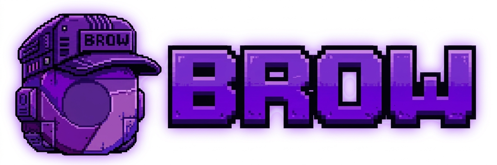
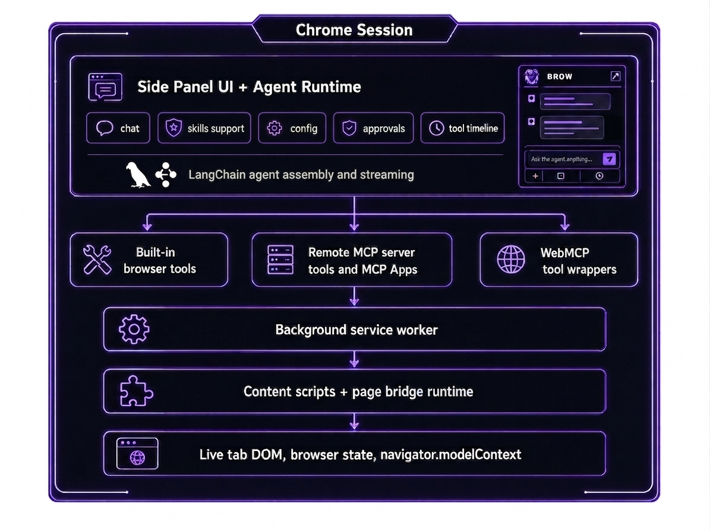

<p align="center">
  
</p>


<p align="center">
  <strong>Brow</strong> is an experimental Chrome side-panel AI browser agent for builders who want <strong>LangGraph.js</strong>, <strong>MCP</strong>, <strong>WebMCP</strong>, and semantic browser automation inside a real Chrome session.
</p>

<p align="center">
  
  
  
  
  
</p>


<p align="center">
  
</p>

## Why Brow

Brow is an open-source AI agent that operates directly in the browser.

- It runs inside the user's live Chrome session instead of spinning up a detached automation browser.
- It gives the agent semantic browser context through **Browser Snapshots**, form semantics, and structured refs instead of raw DOM dumping.
- It combines three tool worlds in one side panel: built-in browser tools, page-local **WebMCP** tools, and remote **MCP** server tools.
- It keeps browser-native workflows close to the model with workflow demonstrations, reusable skills, and local domain memory.

## Core Capabilities

| Capability | What Brow provides |
|---|---|
| Browser Snapshots | Compact, ref-based snapshots of the live DOM so the agent can reason over visible structure and act on fresh targets. |
| Whole-form semantics | Form snapshots with field purposes, safe current values, validation cues, and submit semantics for batch form work. |
| WebMCP page tools | Dynamic discovery of page-local tools exposed through `navigator.modelContext` on the active tab. |
| Remote MCP servers and MCP Apps | HTTP/SSE MCP connectivity, tool discovery, and inline rendering for approved app-backed tool results. |
| Real side-panel workflow | A Manifest V3 Chrome extension with chat, tool timeline, approvals, configuration, and tab-aware execution in the side panel. |
| Workflow demonstrations, skills, and memory | Recorded workflows, skill mentions, domain memory, and reusable operational knowledge that help Brow improve over time. |

## Architecture At A Glance

<p align="center">
  
</p>

For the maintainer-oriented runtime map, see [docs/maintainer-architecture.md](docs/maintainer-architecture.md).

## Quick Start

### Prerequisites

- Node.js `>= 20`
- npm `>= 9`
- Chrome or another Chromium browser with extension developer mode

### 1. Install dependencies

```bash
npm install
```

### 2. Build Brow

```bash
# production build
npm run build

# or keep a watch build running during development
npm run dev
```

### 3. Load the extension

1. Open `chrome://extensions`.
2. Enable **Developer mode**.
3. Click **Load unpacked**.
4. Select the local `dist/` folder generated by the build.
5. Open Brow from the extension icon or Chrome side panel.

### 4. Configure the model and tools

1. Open Brow's **Options** page or the in-sidepanel config surface.
2. Set your OpenAI-compatible base URL, API key, model, and context window.
3. Optionally configure a VLM endpoint, MCP servers, and feature toggles such as WebMCP or MCP Apps.

## Useful Scripts

| Command | Purpose |
|---|---|
| `npm run dev` | Webpack watch build for extension development |
| `npm run build` | Production build to `dist/` |
| `npm run clean` | Remove build output |
| `npm run typecheck` | TypeScript validation without emitting files |
| `npm test` | Prepare fixtures and run the Node test suite |
| `npm run verify` | Run typecheck, tests, and production build |

## Project Map

| Path | Purpose |
|---|---|
| `src/sidepanel/` | Side-panel UI, LangGraph agent runtime, tool assembly, MCP client, skills, and chat flow |
| `src/content-script/` | Browser Snapshot engine, WebMCP bridge, DOM inspection, and workflow recording |
| `src/background/` | Tab lifecycle observation, message routing, and WebMCP discovery coordination |
| `src/options/` | Extension options page for endpoint, transport, and feature-level configuration |
| `src/shared/` | Shared contracts, storage helpers, config normalization, and reusable types |
| `src/html-app-view/` | Brow-hosted HTML app rendering surface |
| `docs/` | Feature guide, maintainer architecture, ADRs, and visual assets |
| `tests/` | Node-based test suite for architecture, tool shape, browser semantics, and UI formatting |
| `test-page/` | Local fixture pages for WebMCP and browser automation development |

## Documentation

- [docs/extension-features.md](docs/extension-features.md) for the implementation-backed feature inventory
- [docs/maintainer-architecture.md](docs/maintainer-architecture.md) for runtime flow and code ownership
- [CONTEXT.md](CONTEXT.md) for Brow's canonical product vocabulary
- [docs/adr/](docs/adr/) for architectural decisions and design history
- [docs/full-spectrum-automation-plan.md](docs/full-spectrum-automation-plan.md) for deeper planning context around Brow's automation direction

## Status

Brow is currently **experimental** and optimized for builders, contributors, and early adopters who are comfortable loading an unpacked extension and iterating locally. The README intentionally describes a self-hosted workflow; it does not assume Chrome Web Store distribution or a fully stabilized public API surface yet.

## License

Brow is licensed under the [Apache License 2.0](LICENSE).
